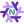

<h1>
  
</h1>

# My Neovim Configurations

My portable Neovim configuration powered by Nix Flakes.

**_Note_**: There are upcoming changes being actively made so documentation will change and may not necessarily be up to date!

# Features

- Custom plugins utilizing mnw's internal plugin interpreter, so we don't need
  to use `buildVimPlugins`!
